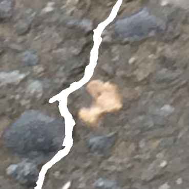

# Dual-path network combining CNN and transformer for pavement crack segmentation 

The [paper](https://doi.org/10.1016/j.autcon.2023.105217) has been accepted by **Automation in Construction**！ Main framework of the proposed network is as follows:
<div align=center>

</div>

We have uploaded a model code implemented using **PyTorch**, which is simple and brief. And we also uploaded the [example weights](weights/example001.pth) trained on the [DeepCrack](https://github.com/yhlleo/DeepCrack) dataset, which can help us better experience the model's performance.

Here are two visual examples:

(1) Obtain binary segmentation mask:
<div align=center>
 
</div>

(2) Obtain the segmentation mask based on the original image:
<div align=center>
 
</div>


More details will be described in our [paper](https://doi.org/10.1016/j.autcon.2023.105217). If this work is helpful to you, or if you need to use our network in your work, please cite us:
```
@article{WANG2024105217,
title = {{Dual-path network combining CNN and transformer for pavement crack segmentation}},
journal = {Automation in Construction},
volume = {158},
pages = {105217},
year = {2024},
issn = {0926-5805},
doi = {10.1016/j.autcon.2023.105217},
author = {Jin Wang and Zhigao Zeng and Pradip Kumar Sharma and Osama Alfarraj and Amr Tolba and Jianming Zhang and Lei Wang}
}
```
